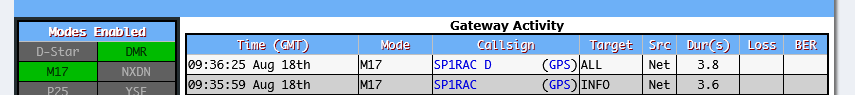
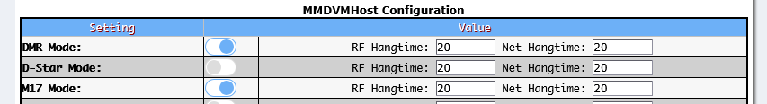
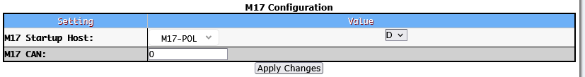

# m17 - konfiguracja Pi-Star 4.2.6 

**UWAGA! Zanim przystąpisz do zmian w Pi-Star zrób aktualną kopię:  _Pi-Star Dashboard -> Configuration -> Backup/Restore -> Download Configuration._ **

Informacje wstępne: 
W konfiguracji [Pi-Star](https://www.pistar.uk/) lista Relfektorów M17 pobieranych automatycznie znajduje się w następującym pliku:  
**/usr/local/etc/M17Hosts.txt**  
W celu dodania własnego reflektora np. M17-POL należy utworzyć plik: **/root/M17Hosts.txt** i dokonać wpisu:  "M17-POL  51.38.132.8  17000"  
Wykonaj następujące polecenia po zalogowaniu się do SSH Pi-Star:   
**rpi-rw  
sudo -i  
touch M17Hosts.txt  
echo -e "M17-POL\t51.38.132.8\t17000" > M17Hosts.txt  
exit  
sudo pistar-update  **
  Nasz dodatkowy wpis będzie zawsze dodawany automatycznie po update na końcu pliku /usr/local/etc/M17Hosts.txt  
Możesz to sprawdzić komendą: **grep -r 'M17-POL'  /usr/local/etc/M17Hosts.txt**  
Konfiguracja Pi-Star 
Zaloguj się do _Pi-Star Dashboard -> Configuration_ włącz  **M17 mode** i przycisk _Apply Changes_. 
 
Następnie w **M17 Configuration** wybierz z listy **M17 Startup Host: M17-POL,module D.**  zapisz zamian:  Apply Changes 

 
Jeśli chcesz zmienić suffix z R np. na H zmień wpis Suffix=R w pliku /etc/m17gateway  

**rpi-rw  
sudo nano /etc/m17gateway  **

Pamiętaj! Z tego samego zewnętrznego adresu IP co posiada HotSpot z Pi-Starem nie połączysz się z aplikacją QSO One. 
Połącz się z innego adresu IP! 
_Vy 73! de SP1RAC, Kazimierz - Koszalin 18.08.2026_
