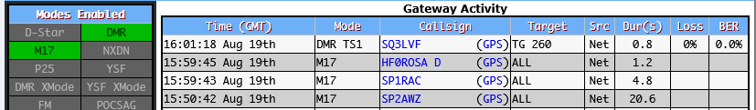
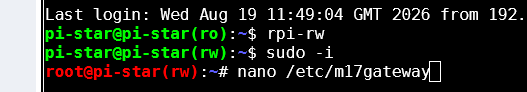
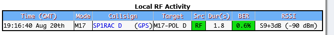

# m17 - konfiguracja Pi-Star 4.2.6 
Dashboard reflektor M17-POL: https://m17.hblink.network/
Module list M17:POL: https://m17.hblink.network/index.php?show=modules

**UWAGA! Zanim przystąpisz do zmian w Pi-Star zrób aktualną kopię: 
Wejdź przez przeglądarkę na adres: http://pi-star/ lub lokalny adres IP HotSpota  
HostSpot oraz komputer na którym dokonujesz wpisów musi być w tej samem sieci w tej samej puli adresowej 
_Pi-Star Dashboard -> Configuration -> Backup/Restore -> Download Configuration._ ** 
Informacje wstępne: 
W konfiguracji [Pi-Star](https://www.pistar.uk/) lista Relfektorów M17 pobieranych automatycznie znajduje się w następującym pliku:  
**/usr/local/etc/M17Hosts.txt**  
W celu dodania własnego reflektora np. M17-POL należy utworzyć plik: **/root/M17Hosts.txt** i dokonać wpisu:  "M17-POL  51.38.132.8  17000"  
Logowanie do Pi-Star SSH:
Wejdź przez przeglądarkę na adres: http://pi-star/ lub IP.  
-> Configuration -> Expert -> SSH Access  
login: pi-star 
password: raspberry   
Wykonaj następujące polecenia po zalogowaniu się do SSH Pi-Star:  
**rpi-rw  
sudo -i  
touch M17Hosts.txt  
echo -e "M17-POL\t51.38.132.8\t17000" > M17Hosts.txt  
exit  
sudo pistar-update  **
  Nasz dodatkowy wpis będzie zawsze dodawany automatycznie po update na końcu pliku /usr/local/etc/M17Hosts.txt  
Możesz to sprawdzić komendą: **grep -r 'M17-POL'  /usr/local/etc/M17Hosts.txt**  
Konfiguracja Pi-Star 
Zaloguj się do _Pi-Star Dashboard -> Configuration_ włącz  **M17 mode** i przycisk _Apply Changes_. 
 
Następnie w **M17 Configuration** wybierz z listy **M17 Startup Host: M17-POL,module D.**  zapisz zamian:  Apply Changes 

 
Jeśli chcesz zmienić suffix z R np. na H zmień wpis Suffix=R w pliku /etc/m17gateway  
R-Repeaters, H-Hotspots 
Wykonaj następujące polecenia po zalogowaniu się do SSH Pi-Star:  
**rpi-rw  
sudo -i  
nano /etc/m17gateway  **
 

Po zamianie w wierszu Suffix=R na Suffix=H wciskamy przycisk **CTRL** razem z przyciskiem **X** -> następnie zapisujemy bufor literą **Y**es -> i wciskamy **Enter** by zapisać zmiany w pliku /etc/m17gateway 
**exit 
exit **
Następnie należy przeprowadzić reboot hotspota _-> Dashboard -> Admin -> Power -> Reboot_  
Pamiętaj! Z tego samego zewnętrznego adresu IP co posiada HotSpot z Pi-Starem nie połączysz się z reflektorem M17_POL przez aplikację. 
Połącz się z innego adresu IP!  
Jestem już po pierwszych próbach transmisji M17 RF - mały krok do przodu :)
 
_Vy 73! de SP1RAC, Kazimierz - Koszalin
